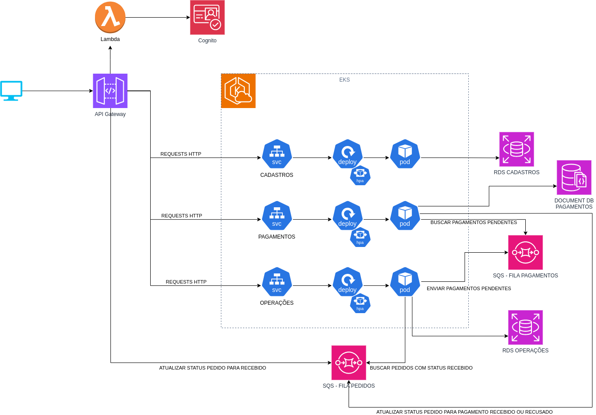

# microservico-pagamento

Responsável por
    - operacionalizar a cobrança de um pedido
    - registrar a solicitação de pagamento
    - receber o retorno do processador de pagamento
    - atualizar o status do pedido

## Arquitetura



## SAGA coreografado

Nós utlizamos o padrão SAGA coreografado para garantir a consistência dos bancos de dados e a resiliência dos nossos microsserviços diante do aumento no número de pedidos. Em ambientes baseados em microsserviços, onde as operações são distribuídas, manter a integridade e a consistência dos dados é um desafio considerável. O padrão SAGA, por outro lado, divide as transações em uma série de passos menores e independentes que são gerenciados autonomamente por cada microsserviço. É por isso que optamos especificamente pela coreografia – cada microsserviço publica eventos que desencadeiam ações em outros microsserviços, sem a necessidade de um orquestrador central, reduzindo assim a complexidade do sistema e aumentando a sua flexibilidade.

O uso do SQS, tanto para atualizar o status do pedido quanto para processar pagamentos pendentes, fortalece o sistema ao desacoplar os microsserviços, permitindo a comunicação assíncrona. Dessa forma, falhas temporárias podem ser tratadas pelos microsserviços, que realizam compensações automáticas quando necessário, assegurando que a consistência eventual seja alcançada de forma eficiente, mesmo sob alta carga de requisições.

## Quick-start
Para inicializar o projeto em ambiente local siga os seguintes passos

1. Realizar a instalação das dependências:
    - [docker](https://docs.docker.com/engine/install/)
    - [postman](https://www.postman.com/downloads/)
2. Executar o projeto
```sh
docker compose up --build --force-recreate
```
3. Importar os exemplos de requests para o Postman
    - [collection](tooling/postman/lanchonete.postman_collection.json)
4. Executar as requests via Postman seguindo a ordem numérica
5. Acessar na url `localhost:8082` o SWAGGER com a documentação dos endpoints da API.

## Deployment no Kubernetes via minikube

- Seguir o passo a passo presente em [/deployments/README.md](https://github.com/teamG11/microservico-operacoes/tree/main/deployments) 